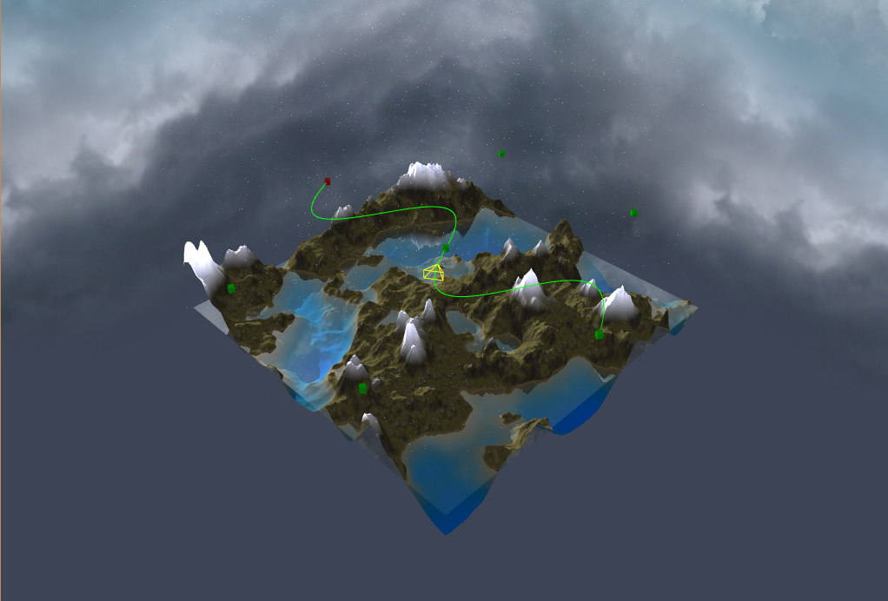
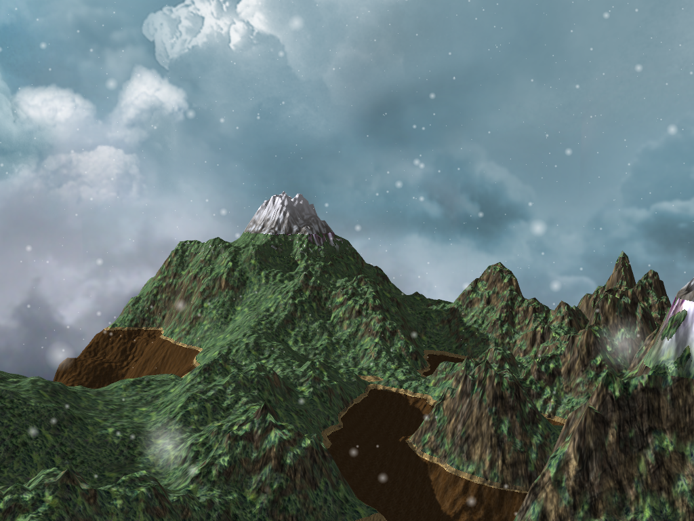
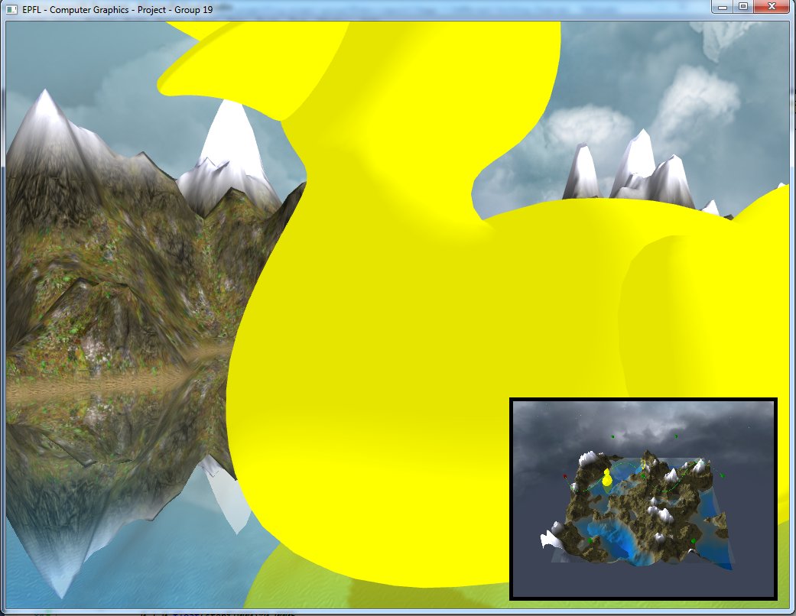

# Terrain

[Michaël Defferrard](https://deff.ch),
[Pierre Fechting](https://www.linkedin.com/in/pierre-fechting-5108b353),
[Vu Hiep Doan](https://www.linkedin.com/in/doanvuhiep).

An OpenGL application which generates a terrain geometry and renders the 3D
scene on the GPU. A camera, pictorially illustrated in the global view, follows
a configurable Bézier path through the scene. It was realized as a semester
project for an introductory lesson in computer graphics at EPFL.

Featured techniques:

* Procedural terrain generated by hybrid multi-fractal with Perlin noise
  function.
* Material texturing based on terrain height and gradient.
* Seamless cube-mapped skybox.
* Self-shadowing using shadow mapping.
* Water reflection, refraction and depth effects.
* Free flying and FPS exploration modes.
* Runtime configurable Bézier camera path: 2 Béziers, 8 control points.
* Animated pictorial camera along the path.
* Particles system: 8000 particles which position and speed are controlled in
  parallel by the GPU.
* Two (interchangeable) simultaneous views: global and camera.
* Object oriented programing.





## Structure

* *group19*: main source code
* *docs/reports*: reports explaining what has been done
* *common*: set of provided CMake and headers
* *external*: provided external libraries
* *textures*, *skybox*, *duck*: texture and vertex ressources

## Build and run

Dependencies:

* [OpenGL](https://www.opengl.org/): profile version >= 3
* [GLFW](http://www.glfw.org/): API version 2
* [GLEW](http://glew.sourceforge.net/)

```sh
cd build
cmake ..
make
./group19/group19
```

## Resources

* [Stage 1 (terrain generation) report](https://deff.ch/terrain_report_1.pdf)
* [Stage 2 (rendering) report](https://deff.ch/terrain_report_2.pdf)
* [Stage 3 (interaction & animation) report](https://deff.ch/terrain_report_3.pdf)
